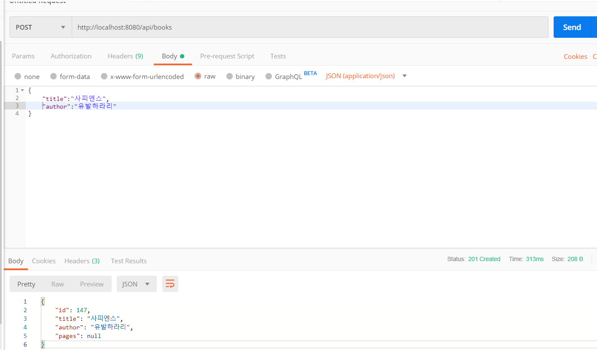

# Spring-Practice

-개인 공부 백업용

[Spring 참조 문서](https://docs.spring.io/spring-boot/docs/current-SNAPSHOT/reference/htmlsingle/)

### ApplicationContext


- [@Configuration](https://docs.spring.io/spring/docs/4.3.5.RELEASE/javadoc-api/org/springframework/context/annotation/Configuration.html) : Spring의 `ApplicationContext`로 의존성을 관리하는 객체를 선언하는 클래스에 붙이는 애너테이션
- [@Bean](https://docs.spring.io/spring/docs/4.3.5.RELEASE/javadoc-api/org/springframework/context/annotation/Bean.html) : `ApplicationContext`에 등록될 객체를 반환하는 객체에 붙일 애노테이션
- [ConfigurableApplicationContext](http://docs.spring.io/spring/docs/current/javadoc-api/org/springframework/context/ConfigurableApplicationContext.html) : `ApplicationContext` 의 하위 인터페이스로 어플리케이션 종료시에 자원을 정리하는 `close()` 메서드를 제공한다.
- [AnnotationConfigApplicationContext](http://docs.spring.io/spring/docs/current/javadoc-api/org/springframework/context/annotation/AnnotationConfigApplicationContext.html) : `ConfigurableApplicationContext`를 구현한 클래스로 `@Configuration`이 붙은 클래스로부터 객체 설정을 읽어온다.

핵심 코드

```java
ConfigurableApplicationContext context = new AnnotationConfigApplicationContext(AppConfig.class);
DataSource dataSource = context.getBean(DataSource.class);
```

위의 코드는 아래 코드와 같은 역할

```java
DataSource dataSource = new AppConfig().dataSource();
```

`Spring framework`을 쓰지 않는다면 `AppConfig`와 같이 어플리케이션에서 자주 참조되는 객체를 생성하는 클래스를 따로 만들고 이를 직접 호출하는 방식으로 객체간의 의존성을 관리할 수도 있다. Spring의 `ApplicationContext`를 도입했을 때의 장점은 아래와 같다.

- 직접 의존성 관리 대상 객체를 생성하는 메서드를 추가할 필요 없이 패키지 범위를 지정하여 일괄 등록할 수 있다(component scan 가능)
- 객체 간의 의존관계가 여러 단계로 얽혀있을 때 이를 더 효율적으로 관리 할 수 있다. 
  - 예를 들면 `BookController` 개체는 `BookService` 객체를 주입받고, `BookService` 객체는 `BookDao` 객체를 주입받는 경우이다.
- Spring이 관리하는 객체에 공통적인 기능을 일괄적으로 집어 넣을 수 있다. 예를 들면 로깅, 트랜잭션 시작과 종료, 예외 변환, 메서드 접근 통제 등이다. 이런 기법을 AOP(Aspect Oriented Programming)이라고 한다.
- 객체가 참조할 속성이지만 환경마다 달라지는 값을 별도의 속성파일로 추출하여 설정할 수 있다. 예를 들면 데이터베이스의 접속 주소 같은 것들이다.
- 어플리케이션 시작 혹은 종료 시에 실행되어야 할 메서드를 호출한다. 예를 들면 @Bean 선언 등으로 관리되는 개체가 java.lang.AutoCloseable을 구현한 클래스라면 ConfigurableApplicationContext.close()이 호출되는 시점에 일괄적으로 해당 bean 클래스의 close() 메서드가 호출된다.

위의 장점 중 일부는 이 과정의 나머지 부분에서 드러날 것이다.

참고로, Spring MVC로 만든 웹어플리케이션에서 직접적으로 `ApplicationContext`을 호출할 일은 많지는 않다. Spring MVC는 URL 요청을 Controller의 메서드로 연결해주고, Controller에 의존하는 클래스들은 멤버변수로 이미 주입된 상태로 쓰기 때문이다. 

에러 로그를 확인하고 문제가 생겼을 때 원인을 파악하기 위해서는 `ApplicationContext`의 존재와 역할을 이해해야한다.


### Component scan

Spring에서 제공하는 'component scan'기능을 이용하면 특정 패키지에 있는 클래스를 일괄적으로 bean으로 등록할 수 있다.

- Spring의 다음과 같은 애너테이션을 활용한다. 
  - `@ComponentScan`
  - `@Repository`


### Properties


- `src/main/resource/application.properies`에 DB 접속 정보를 기술하고 Java 파일에서는 이를 참조한다.
- Spring의 아래 애너테이션을 활용한다.
  - [@PropertySource](http://docs.spring.io/spring-framework/docs/current/javadoc-api/org/springframework/context/annotation/PropertySource.html): ApplicationContext가 properties 파일을 인지할 수 있도록 위치를 지정한다.
  - [@Value](http://docs.spring.io/spring/docs/current/javadoc-api/org/springframework/beans/factory/annotation/Value.html) : ApplicationContext에서 관리되는 값을 자바 객체에 주입한다.


### SimpleJdbcInsert

직접 SQL을 작성하지 않고 Spring JDBC의 SimpleJdbcInsert를 INSERT 구문을 자동생성해서 실행한다,


- Spring JDBC의 아래 클래스를 활용
  - [SimpleJdbcInsert](http://docs.spring.io/spring/docs/current/javadoc-api/org/springframework/jdbc/core/simple/SimpleJdbcInsert.html)
  - [BeanPropertySqlParameterSource](http://docs.spring.io/spring-framework/docs/current/javadoc-api/org/springframework/jdbc/core/namedparam/BeanPropertySqlParameterSource.html)


### 테스트 : JUnit

**src/test/java** 경로에 클래스 파일을 추가해서 테스트하는 식으로 `Java Build Path` 에서 `JUnit` 라이브러리를 추가해주거나 `pom.xml` 에 junit dependency를 추가해주면 된다.


+

**assertThat**

`assertThat(T actual, Matcher<? super T> matcher)`


import static으로 짧게 줄여서 간단 작성 가능.

```java
import static org.hamcrest.CoreMatchers.is;
import static org.junit.Assert.assertThat;
public class CalculatorTest {
    Calculator calculator = new Calculator();
    @Test
    public void testAdd() {
        int result = calculator.add(4, 6);
        assertThat(result, is(10));
    }
}
```


테스트는 중요하다. 테스트 커버리지가 곧 프로그램의 품질인 시대이지만, 사실 더욱 중요한 것은 쉽게 읽을 수 있는 테스트코드를 작성하는 것이다.

테스트코드는 API를 작성한 개발자의 의도를 가장 잘 드러낸 코드이다. 새롭게 기능을 추가하거나, 버그를 수정할 경우 테스트를 먼저 읽고 접근하며, 이 테스트 코드가 읽기 쉬울수록 더욱 빠르게 코드를 수정해 나갈 수 있을 것이다.

읽기 쉬운 코드가 무엇인지에 대해서는 쉽게 정의할 수는 없다. 하지만 길이가 작을수록 읽기 쉽다는 것은 분명한 사실이다. JUnit을 활용한 테스트에서는 assertThat 구문을 활용하여 코드의 길이를 줄이면서도 읽혀지는 코드를 작성할 수 있도록 도와준다. 즉 assertThat을 잘 사용하면 개발자의 의도를 보다 명확하게 드러낼 수 있는 큰 장점을 얻어갈 수 있을 것이다.


### 트랜잭션 롤백

트랜잭션을 시작 한 후에 실행되는 쿼리는 해당 트랜잭선이 롤백될 때는 모두 취소된다. 테스트 시작 전에 트랜잭션을 시작하고, 종료 전에 롤백을 시킨다면 테스트 도중에 만든 데이터는 없어진다.

Spring에서는 이와 같이 트랜잭션을 이용해 테스트 실행 중이 이루어진 DB 조작을 취소하는 기능을 제공한다. 


`PlatformTransactionManager`는 Spring에서 트랜잭션의 시작과 종료, 취소를 할 때 사용하는 인터페이스이다. `DataSourceTransactionManager`는 그 구현체 중의 하나로 `DataSource`로 부터 얻어진 Connection을 이용해 트랜잭션을 관리한다.


ex)

```java
@RunWith(SpringRunner.class)
@ContextConfiguration(classes = AppConfig.class)
@Transactional
public class BookDaoTest {
```

디폴트 정책으로 테스트 메서드가 실행이 끝나는 시점에 트랜잭션을 롤백한다.


### Spring MVC

 Spring MVC는 Spring framework의 모듈로 HTTP 요청을 받고 응답을 보내는 웹 레이어를 담당한다. Spring MVC에서 HTTP 요청 주소 매핑에 쓰이는 대표적인 애너테이션은 `@RequestMapping`이다.


REST API를 구현할 때 추천하는 Spring MVC의 애네테이션은 아래와 같다.

- @RestController
- @GetMapping, @PostMapping, @DeleteMapping, @PutMapping

Controller 클래스안에서 처리할 HTTP 요청을 지정하는데 쓰이는 애너테이션들이다. 각각 HTTP 메서드 중 GET, POST, PUT, DELETE와 대응된다.


**@RestController**

```java
@RestController
public class HelloController{
    
}
```

Spring Boot에서 `@SpringBootApplication` 애너테이션을 붙어 있는 클래스가 있는 패키지와 그 하위 패키지는 자동으로 component scan 된다. 따라서 `HelloController`는 Spring의 ApplicationContext에 등록된다. `@RestController`로 표시되었기에 해당 클래스가 웹요청을 처리할 클래스라는 것이 Spring에게 인식된다.


**@Service**

```java
@Service
public class BookService {
}
```

`@Service`도 `@Conroller`나 `@Repository`처럼 Spring에서 component scan의 대상으로 인지되는 애너테이션이다. 전형적인 스프링 어플리케이션에서는 `@Controller`가 붙은 클래스 -> `@Service`가 붙은 클래스 -> `@Repository`가 붙은 클래스로 요청의 흐름이 이어진다.

이렇게 component  scan의 대상을 지정하는 애너테이션을 구분해서 사용하면 레이어별 역할에 따라서 공통 정책을 정의하기에 용이하다.

예를 든다면 `@Respository`가 붙은 클래스에서 다른 프레임워크에 특화된 Exception을 던지면 Spring의 DataAccessException으로 변환하는 기능을 추가하는 경우이다.


## REST

REpresentational State Transfer 용어의 약자, 웹의 장점을 최대한 활용할 수 있는 아키텍처


### 구성

- **자원(Resource)**- URL
- **행위(Verb)** - HTTP METHOD
- **표현(Representations)**


### 특징

- Uniform(유니폼 인터페이스) - URL로 지정한 리소스에 대한 조작을 통일되고 한정적인 인터페이스로 수행하는 아키텍처 스타일
- Stateless(무상태성) - 작업을 위한 상태정보를 따로 저장하고 관리자 않는다. 세션 정보나 쿠키 정보를 별도로 저장하고 관리하지 않기 때문에 API 서버는 들어오는 요청만을 단순히 처리하면 된다. 
  `서비스의 자유도가 높아지고  서버에서 불필요한 정보를 관리하지 않음으로써 구현이 단순해진다`
- Cacheable(캐시 가능) - HTTP가 가진 캐싱 기능 적용 가능하다. 왜냐하면 HTTP 기존 웹표준을 그대로 사용하기 때문, 웹에서 사용하는 기존 인프라를 그대로 활용 가능하다. *Last-Modified태그나 E-Tag를 이용하면 캐싱 구현이 가능*
- Self-descriptiveness(자체 표현 구조) - REST API 메세지만 보고도 쉽게 이해할 수 있는 자체 표현 구조
- Client - Server 구조 - REST 서버는 API 제공, 클라이언트는 사용자 인증이나 컨텍스트(세션, 로그인 정보)등을 직접 관리하는 구조로 각각의 역할이 구분되기 때문에 클라이언트와 서버에서 개발해야 할 내용이 명확해지고 `서로간 의존성이 줄어들게 된다`
- 계층형 구조 - 다중 계층으로 구성 가능. 보안, 로드 밸런싱, 암호화 계층을 추가해 구조상의 유연성을 둘 수 있다. PROXY, 게이트웨이 같은 네트워크 기반의 중간매체를 사용할 수 있게 한다


### REST API


- URL는 정보의 자원을 표현해야 한다.
- 자원에 대한 행위는 HTTP Method(GET, POST, PUT , DELETE)로 표현한다.


POST, GET, PUT, DELETE 이 4가지의 Method를 가지고 CRUD를 할 수 있다.

| METHOD |                             역할                             |
| :----: | :----------------------------------------------------------: |
|  POST  |      POST를 통해 해당 URI를 요청하면 리소스를 **생성**.      |
|  GET   | GET를 통해 해당 리소스를 **조회**. 리소스를 조회하고 해당 도큐먼트에 대한 자세한 정보를 가져온다. |
|  PUT   |           PUT를 통해 해당 리소스를 **수정**합니다.           |
| DELETE |            DELETE를 통해 리소스를 **삭제**합니다.            |

다음과 같은 식으로 URI는 자원을 표현하는 데에 집중하고 행위에 대한 정의는 HTTP METHOD를 통해 하는 것이 REST한 API를 설계하는 중심 규칙.


REST 개념 및 스타일 참조: https://meetup.toast.com/posts/92


### TEST



https://www.edwith.org/boostcamp_web/joinLectures/9924
